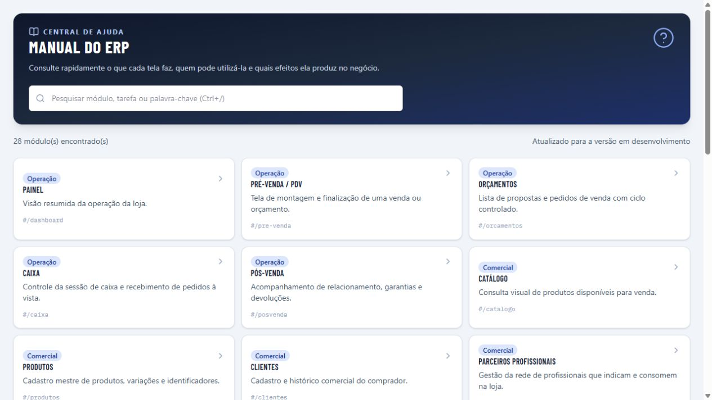

# Manual do usuário — ERP Comercial

> **Versão:** DEV em 02/09/2026 · **Público:** usuário final da loja

Esta é a wiki operacional do ERP para lojas de materiais elétricos, hidráulicos,
ferragens e ferramentas. Use a busca **Ajuda** no topo do sistema para consultar
uma tela sem sair da operação. A regra do backend sempre prevalece sobre um
texto, botão ou atalho apresentado nesta wiki.



*Figura 1 — Central de ajuda em DEV, estado de consulta, versão de desenvolvimento.*
No mobile, a mesma tela foi validada em `capturas/manual-central-mobile-dev.png`.

## Comece por aqui

- [Visão geral e rotina diária](01-visao-geral.md)
- [Acesso, perfis e segurança](02-acesso-e-seguranca.md)
- [Pré-venda, orçamento e caixa](03-vendas.md)
- [Produtos, clientes e parceiros](04-cadastros-comerciais.md)
- [Compras e fornecedores](05-compras.md)
- [Estoque e qualidade](06-estoque.md)
- [Financeiro, bancos e plano de contas](07-financeiro.md)
- [Preços e histórico](08-precos.md)
- [Fiscal](09-fiscal.md)
- [Relatórios e decisões](10-relatorios.md)
- [Pós-venda](11-pos-venda.md)
- [Configurações, atualizações e integrações](12-administracao.md)
- [Atalhos do PDV](13-atalhos-pdv.md)
- [Capturas de tela e critérios de atualização](14-capturas-e-atualizacao.md)

## Fluxo principal da loja

```text
Cadastro → Compra → Recebimento → Estoque → Pré-venda → Orçamento/Pedido
                                                        ↓
                                  Caixa (à vista) ou Financeiro (a prazo)
                                                        ↓
                                                   Fiscal e Relatórios
```

## Como ler cada página

Cada capítulo informa o que é a tela, para que serve, seu papel no sistema,
quem pode usar, pré-requisitos, passo a passo, atalhos, bloqueios e efeitos de
auditoria. As referências visuais são mantidas em `capturas/` e devem ser
produzidas no DEV com massa anonimizada antes de uma versão de treinamento.

## Regra de segurança

Não compartilhe usuário ou senha. O operador deve trabalhar somente com as
permissões do próprio perfil. Crédito, desconto fora da alçada, recebimento,
baixa financeira, emissão fiscal e alterações de configuração são controlados
no backend e podem exigir outro responsável.
